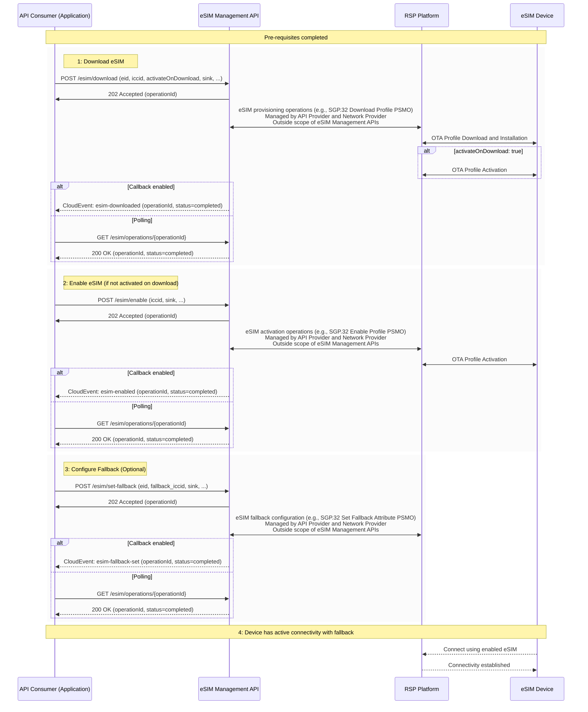

# High level description of eSIM Management concept and API

## Introduction

eSIM (embedded SIM) technology allows remote provisioning and management of cellular connectivity without physical SIM card replacement. The CAMARA eSIM Management API provides a unified interface for eSIM lifecycle operations including download, enable, disable, delete, and fallback configuration.

The target of the eSIM operations is typically the device (as opposed to the cellular network).

**Terminology Note**: In this API, "eSIM" and "eSIM profile" refer to the same thing - downloadable connectivity configurations installed on eSIM hardware. We use "eSIM" for simplicity.

**Key roles**

| **Role Name** | **Description** |
| ---- | ------- |
| API Consumer | The entity that consumes the eSIM Management APIs |
| API Provider | The entity that provides the eSIM Management APIs |
| Network Provider | The entity that provides the physical network resources and Remote SIM Provisioning (RSP) platform |
| Device Owner | The entity that owns or manages the devices containing eSIM hardware |

## eSIM Management Operations

The API operations are summarized in the table below:

| **Operation** | **Purpose of the Operation** | **Key Abstractions and concepts** |
| ---- | ------- | ----|
| Download eSIM | Download and install new eSIM to device | An eSIM represents a downloadable connectivity configuration that can be installed on eSIM hardware (eUICC). The download operation combines SGP.32 Profile Download and Installation into a single operation resulting in a "Disabled" eSIM ready for activation. Optional `activateOnDownload` parameter enables immediate activation after successful download. |
| Enable eSIM | Activate an eSIM which is already downloaded on the device | eSIM Activation makes an installed eSIM active for cellular connectivity (assuming valid connectivity services are configured in the eSIM). Only one eSIM can be enabled per device - enabling an eSIM automatically disables any currently active eSIM. |
| Disable eSIM | Deactivate active eSIM | eSIM Deactivation makes an active eSIM inactive, removing cellular connectivity until another eSIM is enabled. The eSIM remains installed and can be re-enabled. |
| Delete eSIM | Permanently remove eSIM from device | eSIM Deletion permanently removes an eSIM from the device. This operation is irreversible and the eSIM cannot be recovered. The eSIM must be in disabled state before deletion. |
| Set Fallback eSIM | Configure backup eSIM | Fallback Configuration designates a backup eSIM that can be automatically activated if the primary eSIM fails or becomes unavailable, ensuring service continuity. |
| Retrieve Status | Query current status of eSIMs on device | eSIM Status provides current state information for all eSIMs on a device, including active, disabled, and fallback eSIM identification. |

All operations are asynchronous, returning an `operationId` for tracking.

The eSIM Management API provides both callbacks, as well as GET endpoint to query the status and results of eSIM operations.

**Figure**: High-level sequence of steps

## Pre-requisites

Before using the eSIM Management API, agreements must be in place between the API Consumer and API Provider covering:

- Service plans and connectivity options
- Geographic coverage areas
- Device compatibility requirements
- Terms and conditions including pricing

This preparation phase is **outside the scope** of the eSIM Management API.

eSIM Management APIs currently do not support procurement of eSIMs and such a capability may be added in future revisions.

## High-level flow

Main steps:

1. **Download eSIM**: Downloads eSIM to device (EID + ICCID required)
2. **Enable eSIM**: Activates downloaded eSIM for connectivity
3. **Configure Fallback**: Optional backup eSIM for service continuity
4. **Active Connectivity**: Device uses enabled eSIM with optional fallback

## States of eSIM profiles

eSIMs have two states: DISABLED and ENABLED.

**Figure**: lifecycle of an eSIM

- DISABLED: eSIM installed but not active
- ENABLED: eSIM active and providing connectivity
- Only one eSIM can be enabled per device
- Deletion permanently removes eSIMs

## States of operations

Operations are asynchronous with two status states: ACCEPTED and COMPLETED. Operation results (success, failed, cancelled) are separate from status.

**Figure**: lifecycle of an operation

- ACCEPTED: Operation queued for processing
- COMPLETED: Operation finished (check result for outcome)

## Device and eSIM Identification

**Identifiers:**
- **eid**: eUICC Identifier (identifies eSIM hardware)
- **iccid**: eSIM Identifier (identifies specific eSIM)

**Usage:**
- Most eSIM operations require ICCID
- Download/set-fallback additionally require EID (device targeting)
- Status retrieval may accept any identifier

## Event Notifications

CloudEvents-based notifications for operation status:
- Callbacks to provided sink URL
- Polling via GET /esim/operations/{operationId}

## Security and Authorization

- OIDC authentication with granular scopes
- Device ownership validation
- Standard CAMARA error responses